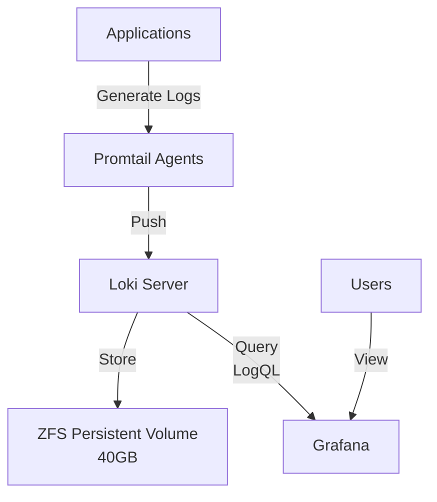

# Loki Logging Infrastructure

This document describes the Loki logging infrastructure implemented in the AIOps platform.

## Overview

The logging infrastructure is built on Grafana Loki, a horizontally-scalable, highly-available, multi-tenant log aggregation system. The implementation includes:

- **Loki**: The core log storage and query system
- **Promtail**: Log collection agents that run on each node
- **Grafana Integration**: Dashboards for log visualization and exploration
- **Log Parsing Rules**: Custom rules for structured log processing
- **Retention Policies**: Configurable retention based on log importance

## Architecture



## Components

### Loki Server

Loki is deployed as a StatefulSet in the `monitoring` namespace with the following characteristics:

- **Storage**: 40GB ZFS-backed persistent volume
- **Retention**: Default 14-day retention, with custom rules for important logs
- **Security**: Non-root user (65534) with proper filesystem permissions
- **Resources**: 1 CPU core, 2GB memory limit

### Promtail Agents

Promtail runs as a DaemonSet, collecting logs from all nodes:

- **Target**: All container logs in the Kubernetes cluster
- **Processing**: Custom parsing rules for structured logs
- **Metrics**: Generates metrics from logs for anomaly detection
- **Labels**: Adds namespace, pod, container, and custom labels

### Log Parsing Rules

Custom parsing rules are defined in the `promtail-parsing-rules` ConfigMap:

- **JSON Parsing**: Extracts fields from structured JSON logs
- **Regex Extraction**: Extracts fields from unstructured logs
- **Metrics Generation**: Creates metrics from log patterns
- **Labeling**: Adds labels for efficient filtering and querying

### Grafana Integration

Loki is integrated with Grafana as a data source:

- **Dashboard**: "AIOps Logs Overview" dashboard for log visualization
- **Exploration**: LogQL query interface for advanced log exploration
- **Alerts**: Log-based alerting for error patterns
- **Correlation**: Metrics and logs correlation for troubleshooting

## Configuration Files

### Loki Values

The `kubernetes/monitoring/loki-values.yaml` file contains the Helm values for Loki deployment:

```yaml
loki:
  persistence:
    enabled: true
    storageClassName: local-path
    size: 40Gi
  securityContext:
    runAsUser: 65534
    runAsNonRoot: true
    runAsGroup: 65534
    fsGroup: 65534
  config:
    schema_config:
      configs:
        - from: 2023-01-01
          store: boltdb-shipper
          object_store: filesystem
          schema: v11
    # ... additional configuration ...
```

### Promtail Values

The `kubernetes/monitoring/promtail-values.yaml` file contains the Helm values for Promtail deployment:

```yaml
config:
  clients:
    - url: http://loki:3100/loki/api/v1/push
  scrape_configs:
    - job_name: kubernetes-pods
      kubernetes_sd_configs:
        - role: pod
      # ... additional configuration ...
```

### Parsing Rules

The `kubernetes/monitoring/promtail-parsing-rules-cm.yaml` file contains custom parsing rules:

```yaml
data:
  custom-rules.yaml: |
    - match:
        selector: '{app="anomaly-detector"}'
        stages:
          - json:
              expressions:
                level: level
                message: message
          # ... additional rules ...
```

## Usage

### Viewing Logs in Grafana

1. Access Grafana at `http://localhost:3000` (via port-forward)
2. Navigate to the "AIOps Logs Overview" dashboard
3. Use the filters to select namespace, pod, and container
4. Use the search box for specific log content

### Using LogQL for Advanced Queries

LogQL is Loki's query language. Some useful examples:

```
# Basic log query
{namespace="default", app="anomaly-detector"}

# Filter by log content
{namespace="default"} |= "error"

# Extract and filter by parsed fields
{namespace="default"} | json | level="error"

# Count error logs over time
sum(count_over_time({namespace="default", level="error"}[5m])) by (pod)
```

### Log-Based Alerting

Loki can be used for log-based alerting in Grafana:

1. Create a Grafana alert based on a LogQL query
2. Set appropriate thresholds and evaluation intervals
3. Configure notification channels
4. Test the alert with sample log data

## Retention Policies

Log retention is configured based on the importance of logs:

- **Default**: 14 days for most logs
- **Error Logs**: 30 days for all error logs
- **AIOps Logs**: 30 days for anomaly detector logs
- **System Logs**: 7 days for routine system logs

## Troubleshooting

### Common Issues

1. **Logs Not Appearing in Grafana**
   - Check Promtail pod status: `kubectl get pods -n monitoring | grep promtail`
   - Check Promtail logs: `kubectl logs -n monitoring -l app=promtail`
   - Verify Loki is running: `kubectl get pods -n monitoring | grep loki`

2. **High Memory Usage**
   - Check Loki resource usage: `kubectl top pod -n monitoring`
   - Consider adjusting query limits in Loki configuration
   - Review log volume and retention settings

3. **Slow Queries**
   - Optimize LogQL queries by adding more specific label filters
   - Reduce the time range for high-cardinality queries
   - Consider adding more specific labels during log collection

### Useful Commands

```bash
# Check Loki status
kubectl get pods -n monitoring | grep loki

# Check Loki logs
kubectl logs -n monitoring deployment/loki

# Check Promtail status
kubectl get pods -n monitoring | grep promtail

# Check Promtail logs
kubectl logs -n monitoring daemonset/promtail

# Port-forward to Loki (for direct API access)
kubectl port-forward -n monitoring service/loki 3100:3100
```

## Best Practices

1. **Structured Logging**: Use structured logging (JSON) in applications
2. **Consistent Labels**: Use consistent labels across all applications
3. **Log Levels**: Use appropriate log levels (INFO, WARN, ERROR)
4. **Correlation IDs**: Include correlation IDs for request tracing
5. **Log Volume**: Be mindful of log volume to avoid storage issues

## Future Enhancements

1. **Log-Based Alerting**: Implement more sophisticated log-based alerts
2. **Log Analytics**: Develop advanced log analytics for anomaly detection
3. **Multi-Cluster Logging**: Extend to collect logs from multiple clusters
4. **Windows Log Collection**: Integrate Windows event logs collection
5. **Log Visualization**: Create more specialized log visualization dashboards 