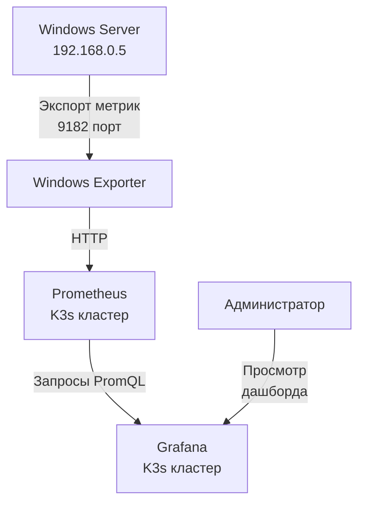

# AIOps Platform - Implementation Plan
## Phase 2: Monitoring & Observability Stack

### Overview
Complete the monitoring infrastructure setup for AIOps platform, focusing on Prometheus, Grafana, and Loki integration with existing Go anomaly detector service.

### Current State
- ✅ K3s cluster running with ZFS storage  
- ✅ Go anomaly detector service compiled and ready
- ✅ Basic HTTP API endpoints implemented
- ✅ Configuration system functional

### Target State
- Prometheus deployed and collecting metrics from anomaly detector
- Grafana dashboards visualizing AIOps metrics
- Loki collecting and aggregating logs
- Full observability stack integrated

## Phase 2.1: Prometheus Stack Deployment

### Requirements Analysis
**Dependencies:**
- K3s cluster (✅ Available)
- Helm 3.x (Need to verify)
- Persistent storage for Prometheus data

**Architecture Decisions:**
- Use Helm charts for Prometheus deployment (kube-prometheus-stack)
- Configure persistent storage on ZFS
- Enable service discovery for Go services
- Set up basic alerting rules

### Implementation Steps

#### Step 1: Helm Setup and Verification
```bash
# Verify Helm installation
helm version

# Add Prometheus community Helm repository
helm repo add prometheus-community https://prometheus-community.github.io/helm-charts
helm repo update
```

#### Step 2: Prometheus Values Configuration
Create custom values file for AIOps-specific configuration:
- Persistent storage configuration
- Service discovery setup
- Basic alerting rules for anomaly detection
- Resource limits suitable for development environment

#### Step 3: Prometheus Deployment
```bash
# Deploy Prometheus stack
helm upgrade --install prometheus prometheus-community/kube-prometheus-stack \
  --namespace monitoring --create-namespace \
  --values kubernetes/monitoring/prometheus-values.yaml
```

#### Step 4: Service Monitor Configuration
Configure Prometheus to scrape metrics from anomaly detector service.

### Expected Outcomes
- Prometheus UI accessible via port-forward or ingress
- Metrics from anomaly detector being collected
- Basic alerting infrastructure ready
- Foundation for Grafana dashboard creation

## Phase 2.2: Grafana Dashboard Development

### Requirements Analysis
**Dashboard Requirements:**
- AIOps platform overview dashboard
- Anomaly detection metrics visualization
- System health and performance monitoring
- Alert status and history

**Technical Approach:**
- Use Grafana provisioning for dashboard-as-code
- Create reusable dashboard templates
- Implement role-based access if needed

### Implementation Steps

#### Step 1: Dashboard Design
Design dashboards for:
1. **AIOps Overview**: High-level platform status
2. **Anomaly Detection**: ML model performance and detections
3. **Infrastructure**: K3s cluster and service health
4. **Application**: Go service performance metrics

#### Step 2: Dashboard Implementation
- Create JSON dashboard definitions
- Configure Grafana provisioning
- Test dashboard functionality
- Document dashboard usage

#### Step 3: Alerting Integration
- Configure Grafana alerts based on AIOps metrics
- Set up notification channels
- Test alert delivery

### Expected Outcomes
- Functional Grafana instance with AIOps dashboards
- Visual monitoring of anomaly detection performance
- Alerting system for critical issues

## Phase 2.3: Loki Logging Infrastructure

### Requirements Analysis
**Logging Strategy:**
- Centralized log collection from all AIOps components
- Structured logging format (JSON)
- Log retention and storage management
- Integration with Grafana for log visualization

**Architecture Decisions:**
- Use Loki for log aggregation
- Promtail for log shipping from pods
- Configure log streaming from Go anomaly detector
- Set up log parsing and labeling

### Implementation Steps

#### Step 1: Loki Deployment
```bash
# Deploy Loki stack
helm upgrade --install loki grafana/loki-stack \
  --namespace monitoring \
  --values kubernetes/monitoring/loki-values.yaml
```

#### Step 2: Application Logging Enhancement
- Update Go anomaly detector to use structured logging
- Configure log output format and levels
- Add correlation IDs for request tracing

#### Step 3: Log Integration
- Configure Grafana to use Loki as log data source
- Create log exploration and alerting dashboards
- Test log aggregation and search functionality

### Expected Outcomes
- Centralized logging for all AIOps components
- Searchable and filterable logs in Grafana
- Structured logging foundation for future services

## Technical Specifications

### Storage Requirements
- **Prometheus**: 10GB persistent volume (ZFS)
- **Loki**: 5GB persistent volume (ZFS)
- **Grafana**: 1GB persistent volume for dashboards

### Resource Allocation
- **Prometheus**: 2 CPU cores, 4GB RAM
- **Grafana**: 1 CPU core, 2GB RAM  
- **Loki**: 1 CPU core, 2GB RAM
- **Promtail**: 0.5 CPU core, 1GB RAM

### Network Configuration
- **Prometheus**: ClusterIP service, port 9090
- **Grafana**: LoadBalancer/NodePort service, port 3000
- **Loki**: ClusterIP service, port 3100
- **Alert Manager**: ClusterIP service, port 9093

## Integration Points

### Anomaly Detector Integration
- **Metrics Exposure**: HTTP endpoint `/metrics` (already implemented)
- **Health Checks**: HTTP endpoint `/health` (already implemented)
- **Logging**: Structured JSON logs to stdout
- **Service Discovery**: Kubernetes service labels for Prometheus

### Configuration Management
- **Helm Values**: Environment-specific configuration
- **ConfigMaps**: Dashboard definitions and alert rules
- **Secrets**: Authentication credentials (if needed)

## Validation Criteria

### Phase 2.1 Success Criteria
- [ ] Prometheus collecting metrics from anomaly detector
- [ ] Prometheus UI accessible and functional
- [ ] Basic alerting rules configured and testing
- [ ] Persistent storage working correctly

### Phase 2.2 Success Criteria  
- [ ] Grafana dashboards displaying AIOps metrics
- [ ] Dashboard provisioning working automatically
- [ ] Alert notifications configured and tested
- [ ] Dashboard documentation complete

### Phase 2.3 Success Criteria
- [ ] Loki collecting logs from all components
- [ ] Logs searchable and filterable in Grafana
- [ ] Structured logging implemented in Go service
- [ ] Log retention policies configured

## Risk Assessment

### High Risk Items
- **Storage Performance**: ZFS performance under load
- **Resource Constraints**: Development environment limitations
- **Configuration Complexity**: Helm chart customization

### Mitigation Strategies
- **Storage**: Monitor ZFS performance, implement compression
- **Resources**: Set appropriate resource limits and requests
- **Configuration**: Use proven Helm chart values, test incrementally

## Timeline Estimate

### Phase 2.1: Prometheus (3-4 days)
- Day 1: Helm setup and values configuration
- Day 2: Prometheus deployment and validation
- Day 3: Service discovery and metrics verification
- Day 4: Alert rules and testing

### Phase 2.2: Grafana (2-3 days)
- Day 1: Dashboard design and development
- Day 2: Dashboard implementation and provisioning
- Day 3: Alert configuration and testing

### Phase 2.3: Loki (2-3 days)
- Day 1: Loki deployment and configuration
- Day 2: Application logging enhancement
- Day 3: Integration testing and validation

**Total Estimated Duration: 7-10 days**

## Post-Implementation Steps

### Documentation
- Update README with monitoring access instructions
- Document dashboard usage and troubleshooting
- Create runbooks for common monitoring tasks

### Testing
- End-to-end monitoring functionality test
- Load testing of monitoring stack
- Disaster recovery testing for persistent data

### Optimization
- Performance tuning based on usage patterns
- Resource optimization for development environment
- Configuration refinement based on operational experience

## Next Phase Preview

After completing Phase 2 (Monitoring), the next planned phase is:
**Phase 3: Terraform & Ansible Automation** - Infrastructure as Code implementation for reproducible deployments.

# Automated Remediation System - Implementation Plan

## Overview

The Automated Remediation System is a critical component of our AIOps platform that enables automatic or semi-automatic responses to detected anomalies. This document outlines the implementation plan and details of the system.

## Architecture

```
┌─────────────────────────────────────────────────────────┐
│                  REMEDIATION LAYER                      │
│                                                         │
│  ┌──────────────┐  ┌─────────────┐  ┌─────────────────┐ │
│  │   Incident   │  │  Response   │  │  Self-Healing   │ │
│  │ Detection    │  │   Engine    │  │   Framework     │ │
│  └──────────────┘  └─────────────┘  └─────────────────┘ │
│                                                         │
└─────────────────────────────────────────────────────────┘
```

## Components

1. **Remediator**: Core orchestrator that manages the remediation process
2. **ActionHandler**: Handlers for different action types (Kubernetes, scripts, notifications)
3. **KubernetesHandler**: Kubernetes-specific remediation actions
4. **ScriptHandler**: Script execution for remediation
5. **API Endpoints**: REST API for incident management and action approval

## Implementation Steps

### 1. Core Remediation Framework

- [x] Create `internal/remediation/remediation.go` with main orchestrator
- [x] Implement incident management and action execution
- [x] Add metrics collection and reporting
- [x] Implement safety mechanisms (retry limits, approval workflow)

### 2. Kubernetes Integration

- [x] Create `internal/remediation/kubernetes.go` for Kubernetes operations
- [x] Implement pod restart functionality
- [x] Implement deployment scaling functionality
- [x] Implement node draining functionality
- [x] Add RBAC and security controls

### 3. Script Execution System

- [x] Create `internal/remediation/scripts.go` for script execution
- [x] Implement secure script execution with prefix validation
- [x] Create default remediation scripts
- [x] Add timeout and error handling

### 4. API and Integration

- [x] Create `internal/api/remediation_handlers.go` for API endpoints
- [x] Create `internal/api/server.go` for API server
- [x] Implement `internal/ml/pipeline_remediation.go` for ML pipeline integration
- [x] Add metrics export for Prometheus

### 5. Configuration and Deployment

- [x] Update `configs/config.yaml` with remediation settings
- [x] Update `kubernetes/remediation/remediation-deployment.yaml` with Kubernetes manifests
- [x] Create test scripts for validation

### 6. Documentation

- [x] Update `docs/remediation-system.md` with system documentation
- [x] Add usage examples and troubleshooting guides

## Security Considerations

1. **Script Execution**: Only scripts with allowed prefixes can be executed
2. **RBAC**: Limited Kubernetes permissions through ServiceAccount
3. **Approval Workflow**: Manual approval required by default
4. **Retry Limits**: Maximum number of retry attempts for failed actions

## Testing Plan

1. **Unit Tests**: Test individual components in isolation
2. **Integration Tests**: Test interaction between components
3. **End-to-End Tests**: Test complete remediation workflows
4. **Security Tests**: Verify security controls and permissions

## Metrics and Monitoring

- `aiops_remediation_incidents_total`: Total number of incidents
- `aiops_remediation_actions_total`: Total number of actions
- `aiops_remediation_actions_success_total`: Successful actions
- `aiops_remediation_actions_failed_total`: Failed actions
- `aiops_remediation_incident_resolution_time_seconds`: Resolution time

## Future Enhancements

1. **ML-based Action Selection**: Use ML to select the best remediation action
2. **Multi-step Remediation**: Complex workflows with multiple actions
3. **Advanced Reporting**: Detailed reports on remediation effectiveness
4. **Integration with External Systems**: Notify external systems about incidents

## Conclusion

The Automated Remediation System provides a robust framework for responding to anomalies detected by our ML pipeline. With its modular design and security features, it offers a scalable solution for automated system healing.

**Implementation Status**: COMPLETED ✅

# План Реализации: Windows Server Мониторинг

## Обзор Фазы

**Цель**: Настроить мониторинг Windows Server (192.168.0.5) с основными метриками (доступность, CPU, RAM, HDD) и интеграцией с существующей инфраструктурой Prometheus/Grafana.

**Сроки**: 1 день (24 июня 2025)

**Сложность**: Уровень 2 (Средняя) - Расширение существующей инфраструктуры мониторинга на Windows-системы

**Предварительные условия**:
- ✅ Кластер K3s с Prometheus и Grafana
- ✅ Сетевой доступ к Windows Server (192.168.0.5)
- ✅ Учетная запись администратора на Windows Server

## Архитектура Решения



## Детальный План Реализации

### 1. Установка Windows Exporter на Windows Server (1 час)

#### 1.1. Подготовка Windows Server

1. Загрузка Windows Exporter:
```powershell
# Выполнить на Windows Server
$url = "https://github.com/prometheus-community/windows_exporter/releases/download/v0.25.0/windows_exporter-0.25.0-amd64.msi"
$output = "$env:TEMP\windows_exporter.msi"
Invoke-WebRequest -Uri $url -OutFile $output
```

2. Установка Windows Exporter как службы:
```powershell
# Выполнить от имени администратора
Start-Process msiexec.exe -ArgumentList "/i $output ENABLED_COLLECTORS=cpu,memory,logical_disk,os,system,net,tcp LISTEN_PORT=9182 /quiet" -Wait
```

3. Проверка работоспособности службы:
```powershell
Get-Service windows_exporter
# Убедиться, что служба запущена (Status: Running)
```

4. Проверка доступности метрик:
```powershell
Invoke-WebRequest -Uri "http://localhost:9182/metrics"
# Должен вернуться HTTP 200 с текстом метрик
```

5. Настройка брандмауэра Windows:
```powershell
New-NetFirewallRule -DisplayName "Windows Exporter" -Direction Inbound -LocalPort 9182 -Protocol TCP -Action Allow
```

### 2. Конфигурация Prometheus для сбора метрик (1 час)

#### 2.1. Добавление Windows Server в конфигурацию Prometheus

Создание файла `kubernetes/monitoring/windows-scrape-config.yaml`:

```yaml
apiVersion: v1
kind: ConfigMap
metadata:
  name: prometheus-windows-scrape
  namespace: monitoring
data:
  windows-scrape.yaml: |
    - job_name: 'windows-server'
      scrape_interval: 30s
      static_configs:
        - targets: ['192.168.0.5:9182']
          labels:
            instance: 'windows-server-prod'
            os: 'windows'
```

#### 2.2. Обновление Prometheus с новой конфигурацией

Обновление файла `kubernetes/monitoring/prometheus-values-final.yaml`:

```yaml
prometheus:
  prometheusSpec:
    # ... существующая конфигурация ...
    
    # Добавление Windows Server в scrape configs
    additionalScrapeConfigs:
      - job_name: 'aiops-anomaly-detector'
        static_configs:
          - targets: ['anomaly-detector.default.svc.cluster.local:8080']
        metrics_path: '/metrics'
        scrape_interval: 30s
      - job_name: 'windows-server'
        scrape_interval: 30s
        static_configs:
          - targets: ['192.168.0.5:9182']
            labels:
              instance: 'windows-server-prod'
              os: 'windows'
```

Применение изменений:

```bash
kubectl apply -f kubernetes/monitoring/windows-scrape-config.yaml
helm upgrade prometheus prometheus-community/kube-prometheus-stack --namespace monitoring --values kubernetes/monitoring/prometheus-values-final.yaml
```

### 3. Создание Grafana Дашборда для Windows Server (2 часа)

#### 3.1. Импорт готового дашборда для Windows Exporter

Создание файла `kubernetes/monitoring/windows-dashboard-cm.yaml`:

```yaml
apiVersion: v1
kind: ConfigMap
metadata:
  name: windows-dashboard
  namespace: monitoring
  labels:
    grafana_dashboard: "1"
data:
  windows-exporter.json: |
    {
      "annotations": {
        "list": [
          {
            "builtIn": 1,
            "datasource": "-- Grafana --",
            "enable": true,
            "hide": true,
            "iconColor": "rgba(0, 211, 255, 1)",
            "name": "Annotations & Alerts",
            "type": "dashboard"
          }
        ]
      },
      "editable": true,
      "gnetId": 10467,
      "graphTooltip": 0,
      "id": null,
      "links": [],
      "panels": [
        {
          "datasource": "Prometheus",
          "fieldConfig": {
            "defaults": {
              "color": {
                "mode": "thresholds"
              },
              "mappings": [],
              "thresholds": {
                "mode": "absolute",
                "steps": [
                  {
                    "color": "green",
                    "value": null
                  },
                  {
                    "color": "red",
                    "value": 80
                  }
                ]
              },
              "unit": "percent"
            },
            "overrides": []
          },
          "gridPos": {
            "h": 8,
            "w": 12,
            "x": 0,
            "y": 0
          },
          "id": 1,
          "options": {
            "orientation": "auto",
            "reduceOptions": {
              "calcs": [
                "lastNotNull"
              ],
              "fields": "",
              "values": false
            },
            "showThresholdLabels": false,
            "showThresholdMarkers": true
          },
          "pluginVersion": "7.5.5",
          "targets": [
            {
              "expr": "100 - (avg by (instance) (rate(windows_cpu_time_total{mode=\"idle\"}[2m])) * 100)",
              "interval": "",
              "legendFormat": "",
              "refId": "A"
            }
          ],
          "title": "CPU Usage",
          "type": "gauge"
        },
        {
          "datasource": "Prometheus",
          "fieldConfig": {
            "defaults": {
              "color": {
                "mode": "thresholds"
              },
              "mappings": [],
              "thresholds": {
                "mode": "absolute",
                "steps": [
                  {
                    "color": "green",
                    "value": null
                  },
                  {
                    "color": "red",
                    "value": 80
                  }
                ]
              },
              "unit": "percent"
            },
            "overrides": []
          },
          "gridPos": {
            "h": 8,
            "w": 12,
            "x": 12,
            "y": 0
          },
          "id": 2,
          "options": {
            "orientation": "auto",
            "reduceOptions": {
              "calcs": [
                "lastNotNull"
              ],
              "fields": "",
              "values": false
            },
            "showThresholdLabels": false,
            "showThresholdMarkers": true
          },
          "pluginVersion": "7.5.5",
          "targets": [
            {
              "expr": "100 * (1 - ((windows_memory_available_bytes) / (windows_os_physical_memory_free_bytes + windows_os_physical_memory_used_bytes)))",
              "interval": "",
              "legendFormat": "",
              "refId": "A"
            }
          ],
          "title": "Memory Usage",
          "type": "gauge"
        },
        {
          "datasource": "Prometheus",
          "fieldConfig": {
            "defaults": {
              "color": {
                "mode": "palette-classic"
              },
              "custom": {
                "axisLabel": "",
                "axisPlacement": "auto",
                "barAlignment": 0,
                "drawStyle": "line",
                "fillOpacity": 10,
                "gradientMode": "none",
                "hideFrom": {
                  "legend": false,
                  "tooltip": false,
                  "viz": false
                },
                "lineInterpolation": "linear",
                "lineWidth": 1,
                "pointSize": 5,
                "scaleDistribution": {
                  "type": "linear"
                },
                "showPoints": "never",
                "spanNulls": true,
                "stacking": {
                  "group": "A",
                  "mode": "none"
                },
                "thresholdsStyle": {
                  "mode": "off"
                }
              },
              "mappings": [],
              "thresholds": {
                "mode": "absolute",
                "steps": [
                  {
                    "color": "green",
                    "value": null
                  },
                  {
                    "color": "red",
                    "value": 80
                  }
                ]
              },
              "unit": "percent"
            },
            "overrides": []
          },
          "gridPos": {
            "h": 8,
            "w": 24,
            "x": 0,
            "y": 8
          },
          "id": 3,
          "options": {
            "legend": {
              "calcs": [],
              "displayMode": "list",
              "placement": "bottom"
            },
            "tooltip": {
              "mode": "single"
            }
          },
          "pluginVersion": "7.5.5",
          "targets": [
            {
              "expr": "100 - (windows_logical_disk_free_bytes{volume=~\"C:\"} / windows_logical_disk_size_bytes{volume=~\"C:\"} * 100)",
              "interval": "",
              "legendFormat": "C: Drive",
              "refId": "A"
            },
            {
              "expr": "100 - (windows_logical_disk_free_bytes{volume=~\"D:\"} / windows_logical_disk_size_bytes{volume=~\"D:\"} * 100)",
              "interval": "",
              "legendFormat": "D: Drive",
              "refId": "B"
            }
          ],
          "title": "Disk Usage",
          "type": "timeseries"
        },
        {
          "datasource": "Prometheus",
          "fieldConfig": {
            "defaults": {
              "color": {
                "mode": "palette-classic"
              },
              "custom": {
                "axisLabel": "",
                "axisPlacement": "auto",
                "barAlignment": 0,
                "drawStyle": "line",
                "fillOpacity": 10,
                "gradientMode": "none",
                "hideFrom": {
                  "legend": false,
                  "tooltip": false,
                  "viz": false
                },
                "lineInterpolation": "linear",
                "lineWidth": 1,
                "pointSize": 5,
                "scaleDistribution": {
                  "type": "linear"
                },
                "showPoints": "never",
                "spanNulls": true,
                "stacking": {
                  "group": "A",
                  "mode": "none"
                },
                "thresholdsStyle": {
                  "mode": "off"
                }
              },
              "mappings": [],
              "thresholds": {
                "mode": "absolute",
                "steps": [
                  {
                    "color": "green",
                    "value": null
                  },
                  {
                    "color": "red",
                    "value": 80
                  }
                ]
              },
              "unit": "binBps"
            },
            "overrides": []
          },
          "gridPos": {
            "h": 8,
            "w": 24,
            "x": 0,
            "y": 16
          },
          "id": 4,
          "options": {
            "legend": {
              "calcs": [],
              "displayMode": "list",
              "placement": "bottom"
            },
            "tooltip": {
              "mode": "single"
            }
          },
          "pluginVersion": "7.5.5",
          "targets": [
            {
              "expr": "rate(windows_net_bytes_received_total[5m])",
              "interval": "",
              "legendFormat": "Received",
              "refId": "A"
            },
            {
              "expr": "rate(windows_net_bytes_sent_total[5m])",
              "interval": "",
              "legendFormat": "Sent",
              "refId": "B"
            }
          ],
          "title": "Network Traffic",
          "type": "timeseries"
        }
      ],
      "refresh": "30s",
      "schemaVersion": 27,
      "style": "dark",
      "tags": [
        "windows",
        "prometheus"
      ],
      "templating": {
        "list": []
      },
      "time": {
        "from": "now-6h",
        "to": "now"
      },
      "timepicker": {},
      "timezone": "",
      "title": "Windows Server Monitoring",
      "uid": "windows-server",
      "version": 1
    }
```

Применение дашборда:

```bash
kubectl apply -f kubernetes/monitoring/windows-dashboard-cm.yaml
```

### 4. Настройка Оповещений для Windows Server (1 час)

#### 4.1. Создание правил оповещений для Windows Server

Создание файла `kubernetes/monitoring/windows-alerts-cm.yaml`:

```yaml
apiVersion: v1
kind: ConfigMap
metadata:
  name: prometheus-windows-alerts
  namespace: monitoring
  labels:
    prometheus_alerts: "1"
data:
  windows-alerts.yaml: |-
    groups:
    - name: windows-server
      rules:
      - alert: WindowsServerDown
        expr: up{job="windows-server"} == 0
        for: 5m
        labels:
          severity: critical
          context: windows
        annotations:
          summary: "Windows Server недоступен"
          description: "Windows Server (192.168.0.5) недоступен более 5 минут."
          
      - alert: WindowsHighCPUUsage
        expr: 100 - (avg by (instance) (rate(windows_cpu_time_total{mode="idle"}[2m])) * 100) > 90
        for: 10m
        labels:
          severity: warning
          context: windows
        annotations:
          summary: "Высокая загрузка CPU на Windows Server"
          description: "Загрузка CPU на Windows Server (192.168.0.5) превышает 90% более 10 минут."
          
      - alert: WindowsHighMemoryUsage
        expr: 100 * (1 - ((windows_memory_available_bytes) / (windows_os_physical_memory_free_bytes + windows_os_physical_memory_used_bytes))) > 90
        for: 10m
        labels:
          severity: warning
          context: windows
        annotations:
          summary: "Высокая загрузка памяти на Windows Server"
          description: "Использование памяти на Windows Server (192.168.0.5) превышает 90% более 10 минут."
          
      - alert: WindowsLowDiskSpace
        expr: 100 - (windows_logical_disk_free_bytes / windows_logical_disk_size_bytes * 100) > 90
        for: 10m
        labels:
          severity: warning
          context: windows
        annotations:
          summary: "Низкий объем свободного места на диске Windows Server"
          description: "Использование дискового пространства на Windows Server (192.168.0.5) превышает 90% более 10 минут."
```

Применение правил оповещений:

```bash
kubectl apply -f kubernetes/monitoring/windows-alerts-cm.yaml
```

### 5. Тестирование и Валидация (1 час)

#### 5.1. Проверка сбора метрик

1. Проверка доступности Windows Exporter в Prometheus:
```bash
kubectl port-forward -n monitoring svc/prometheus-kube-prometheus-prometheus 9090:9090
# Открыть http://localhost:9090/targets и проверить статус цели windows-server
```

2. Проверка наличия метрик Windows:
```bash
# В интерфейсе Prometheus выполнить запрос:
windows_cpu_time_total
# Должны отображаться данные с Windows Server
```

#### 5.2. Проверка дашборда Grafana

1. Доступ к Grafana:
```bash
kubectl port-forward -n monitoring svc/prometheus-grafana 3000:80
# Открыть http://localhost:3000
# Логин: admin
# Пароль: aiops-admin-2024
```

2. Проверка дашборда Windows Server:
   - Найти дашборд "Windows Server Monitoring" в списке дашбордов
   - Убедиться, что все панели отображают данные
   - Проверить актуальность метрик CPU, RAM, HDD и сети

#### 5.3. Проверка оповещений

1. Проверка правил оповещений:
```bash
# В интерфейсе Prometheus открыть раздел Alerts
# Убедиться, что правила для Windows Server отображаются
```

2. Тестирование оповещения о недоступности:
   - Временно остановить службу Windows Exporter на Windows Server
   - Проверить, что через 5 минут появится оповещение WindowsServerDown
   - Запустить службу обратно и убедиться, что оповещение исчезло

## Документация

### Инструкция по Установке Windows Exporter

1. Скачать установщик Windows Exporter с GitHub:
   - https://github.com/prometheus-community/windows_exporter/releases/download/v0.25.0/windows_exporter-0.25.0-amd64.msi

2. Установить с командной строки с нужными коллекторами:
   ```
   msiexec /i windows_exporter-0.25.0-amd64.msi ENABLED_COLLECTORS=cpu,memory,logical_disk,os,system,net,tcp LISTEN_PORT=9182 /quiet
   ```

3. Открыть порт 9182 в брандмауэре Windows.

4. Проверить доступность метрик по адресу http://192.168.0.5:9182/metrics

### Метрики Windows Server

| Метрика | Описание | PromQL запрос |
|---------|----------|--------------|
| CPU Usage | Загрузка процессора в процентах | `100 - (avg by (instance) (rate(windows_cpu_time_total{mode="idle"}[2m])) * 100)` |
| Memory Usage | Использование памяти в процентах | `100 * (1 - ((windows_memory_available_bytes) / (windows_os_physical_memory_free_bytes + windows_os_physical_memory_used_bytes)))` |
| Disk Usage | Использование дискового пространства | `100 - (windows_logical_disk_free_bytes / windows_logical_disk_size_bytes * 100)` |
| Network Traffic | Сетевой трафик | `rate(windows_net_bytes_received_total[5m])`, `rate(windows_net_bytes_sent_total[5m])` |

### Устранение Неполадок

1. **Windows Exporter не запускается**:
   - Проверить логи службы в Event Viewer
   - Убедиться, что установлены все необходимые зависимости
   - Проверить права доступа для службы

2. **Prometheus не видит Windows Exporter**:
   - Проверить сетевую доступность с Prometheus до Windows Server по порту 9182
   - Убедиться, что брандмауэр Windows разрешает входящие соединения
   - Проверить конфигурацию scrape_configs в Prometheus

3. **Дашборд не отображает данные**:
   - Проверить, что источник данных Prometheus правильно настроен в Grafana
   - Убедиться, что метрики Windows доступны в Prometheus
   - Проверить запросы PromQL в панелях дашборда

## Риски и Смягчение

| Риск | Вероятность | Влияние | Стратегия Смягчения |
|------|-------------|---------|---------------------|
| Брандмауэр блокирует доступ | Высокая | Высокое | Правильная настройка правил брандмауэра Windows |
| Высокая нагрузка на Windows Server | Средняя | Среднее | Оптимизация частоты сбора метрик (scrape_interval) |
| Проблемы с правами доступа | Средняя | Высокое | Запуск Windows Exporter от имени администратора |
| Нестабильная сеть между K3s и Windows | Низкая | Высокое | Настройка более длительных таймаутов в Prometheus |

## Критерии Успеха

- ✅ Windows Exporter успешно установлен и запущен на Windows Server
- ✅ Prometheus собирает метрики с Windows Server
- ✅ Grafana отображает дашборд с метриками Windows Server
- ✅ Настроены оповещения для критических метрик Windows Server
- ✅ Документация по установке и устранению неполадок создана

## Следующие Шаги

1. Расширение мониторинга на дополнительные Windows-серверы
2. Настройка мониторинга служб Windows (IIS, SQL Server и т.д.)
3. Интеграция с системой автоматического восстановления
4. Настройка долгосрочного хранения метрик для анализа трендов 

## Phase 3.1: Automated Remediation System

### Overview
Implement an automated remediation system that can respond to anomalies detected by the ML pipeline and perform corrective actions.

### Current State
- ✅ ML pipeline detecting anomalies
- ✅ Kubernetes cluster running with proper RBAC
- ✅ Monitoring stack collecting metrics and logs

### Target State
- Automated remediation system responding to anomalies
- Kubernetes integration for pod/deployment management
- Secure script execution system
- API for incident management and action approval
- Integration with ML pipeline

### Requirements Analysis
**Dependencies:**
- ML pipeline (✅ Available)
- Kubernetes API access (✅ Available)
- Prometheus metrics (✅ Available)

**Architecture Decisions:**
- Modular design with pluggable action handlers
- Security-first approach with prefix-based script validation
- Manual approval workflow by default
- Comprehensive metrics and logging

### Implementation Steps

#### Step 1: Core Remediation Framework
```go
// Create main orchestrator
type Remediator struct {
    config       *types.RemediationConfig
    actions      map[string]*ActionHandler
    incidents    map[string]*Incident
    // ...
}

// Implement incident management
func (r *Remediator) HandleAnomaly(anomaly *types.Anomaly) error {
    // Create incident
    // Determine actions
    // Execute or queue for approval
}

// Implement action execution
func (r *Remediator) executeAction(ctx context.Context, action *types.RemediationAction) {
    // Find handler
    // Execute action
    // Record results
}
```

#### Step 2: Kubernetes Integration
```go
// Create Kubernetes handler
type KubernetesHandler struct {
    clientset *kubernetes.Clientset
}

// Implement pod restart
func (h *KubernetesHandler) handleRestartPod(ctx context.Context, action *types.RemediationAction) (*types.ActionResult, error) {
    // Extract parameters
    // Delete pod
    // Wait for recreation
}

// Implement deployment scaling
func (h *KubernetesHandler) handleScaleDeployment(ctx context.Context, action *types.RemediationAction) (*types.ActionResult, error) {
    // Extract parameters
    // Update deployment replicas
}
```

#### Step 3: Script Execution System
```go
// Create script handler
type ScriptHandler struct {
    scriptsDir string
    timeout    time.Duration
    allowedPrefixes []string
}

// Implement script execution
func (h *ScriptHandler) handleExecuteScript(ctx context.Context, action *types.RemediationAction) (*types.ActionResult, error) {
    // Validate script name
    // Execute script
    // Capture output
}

// Create default scripts
func (h *ScriptHandler) CreateDefaultScripts() error {
    // Create restart_service.sh
    // Create fix_disk_space.sh
    // Create scale_deployment.sh
}
```

#### Step 4: API and Integration
```go
// Create API handlers
func (h *RemediationHandler) RegisterHandlers(mux *http.ServeMux) {
    mux.HandleFunc("/api/v1/incidents", h.handleIncidents)
    mux.HandleFunc("/api/v1/actions", h.handleActions)
    mux.HandleFunc("/api/v1/metrics/remediation", h.handleMetrics)
}

// Implement ML pipeline integration
func (i *PipelineRemediationIntegration) processAnomalies() {
    // Get recent anomalies
    // Send to remediation system
}
```

#### Step 5: Configuration and Deployment
```yaml
# Update config.yaml
remediation:
  enabled: true
  auto_execute: false
  max_retries: 3
  retry_delay: 30s
  scripts_dir: "/etc/aiops-detector/scripts"
  script_timeout: 60s
  allowed_prefixes:
    - "restart_"
    - "fix_"
    - "scale_"

# Update Kubernetes deployment
apiVersion: apps/v1
kind: Deployment
metadata:
  name: aiops-remediation
spec:
  # ...
  template:
    # ...
    spec:
      serviceAccountName: aiops-remediation
      # ...
```

#### Step 6: Testing and Documentation
```bash
# Create test script
#!/bin/bash
# Test remediation system
API_URL="http://localhost:8080"
curl -s "${API_URL}/api/v1/incidents"
```

### Expected Outcomes
- Functional remediation system responding to anomalies
- Secure script execution with proper validation
- Kubernetes integration for pod/deployment management
- API for incident management and action approval
- Integration with ML pipeline
- Comprehensive metrics and documentation

## Technical Specifications

### Component Structure
- **Remediator**: Core orchestrator
- **ActionHandler**: Action type handlers
- **KubernetesHandler**: Kubernetes operations
- **ScriptHandler**: Script execution
- **API Endpoints**: REST API for management

### Action Types
- **restart**: Restart pods or deployments
- **scale**: Scale deployments
- **script**: Execute remediation scripts
- **notification**: Send notifications

### Security Measures
- Script prefix validation
- RBAC for Kubernetes operations
- Manual approval workflow
- Retry limits and timeouts

## Integration Points

### ML Pipeline Integration
- ML pipeline detects anomalies
- Anomalies sent to remediation system
- Remediation system creates incidents
- Actions executed based on configuration

### API Integration
- REST API for incident management
- Endpoints for action approval
- Metrics export for Prometheus

## Validation Criteria

### Success Criteria
- [x] Remediation system responding to anomalies
- [x] Kubernetes integration working correctly
- [x] Script execution secure and functional
- [x] API endpoints accessible and working
- [x] Integration with ML pipeline complete
- [x] Documentation and testing complete

## Risk Assessment

### Potential Risks
- **Security**: Unauthorized script execution
- **Stability**: Incorrect remediation actions
- **Performance**: High load during incident storms

### Mitigation Strategies
- Script prefix validation and RBAC
- Manual approval workflow by default
- Retry limits and rate limiting
- Comprehensive testing and monitoring